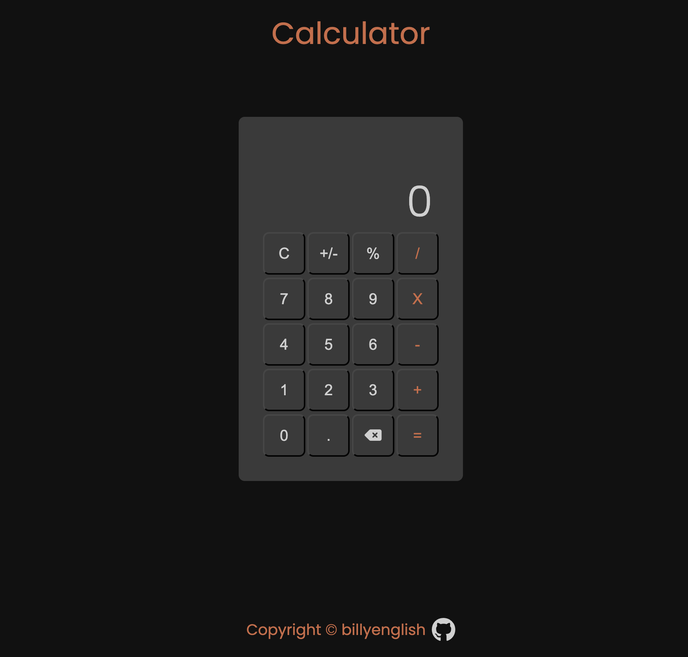

# Calculator

## I built a simple calculator that had these type of features.

* Numberical Values: 0-9
* Sum Operand
* Subtraction Operand
* Product Operand
* Division Operand
* Percentage Operand
* Plus/Minus Operand
* Decimal Operand